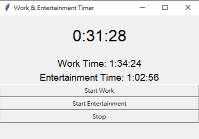

# Work-Life Balance Timer



## Overview
The Work-Life Balance Timer is a user-friendly desktop application designed to help you manage your work and entertainment time effectively, promoting a healthy work-life balance. By tracking the time you spend on work and allowing you to "earn" entertainment time, this intuitive timer app ensures you have a balanced approach to your daily routine.

## Features
- Easy-to-use graphical user interface (GUI)
- Separate timers for work and entertainment
- Start, pause, and stop functionality for both work and entertainment modes
- Displays the time remaining for entertainment based on work time accrued
- Audio cues for transitioning between modes and reaching the end of entertainment time
- Ability to play background music during work mode

## Usage
1. Launch the application to see the main timer window with two buttons: Start Work and Start Entertainment.
2. Click on the **Start Work** button to begin tracking your work time. The timer will display the time remaining for entertainment based on the work time accrued.
3. To transition to entertainment mode, click on the **Start Entertainment** button. The timer will then begin to count down the available entertainment time based on the work time you've earned.
4. The application will play an alarm sound when your entertainment time runs out, signaling it's time to return to work mode.
5. Pause functionality is available by clicking the appropriate button for the mode you're currently in.
6. Enjoy a more balanced work-life experience with this helpful timer app!

## Requirements
- Python 3.x
- tkinter
- pygame.mixer

## Installation
1. Clone the repository or download the source code.
2. Install the required libraries using pip:
```
pip install -r requirements.txt
```
3. Run the application by executing the `main.py` file:
```
python main.py
```
Start your journey towards a healthier work-life balance with the Work-Life Balance Timer!
